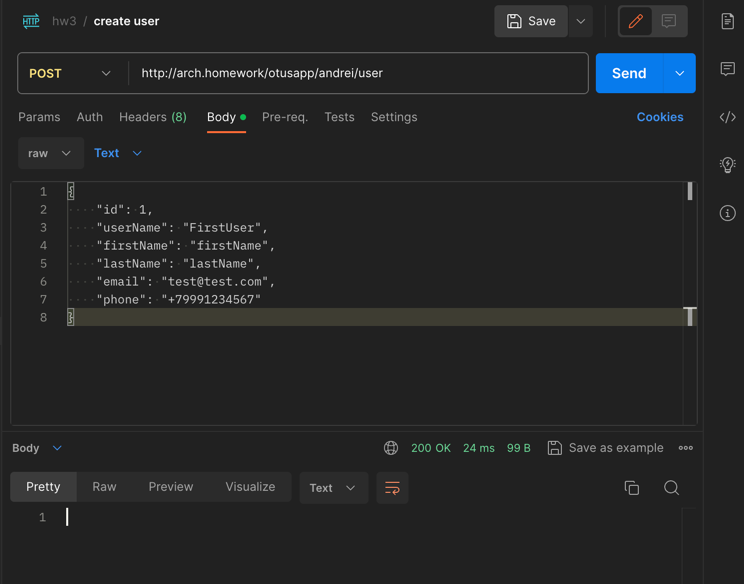
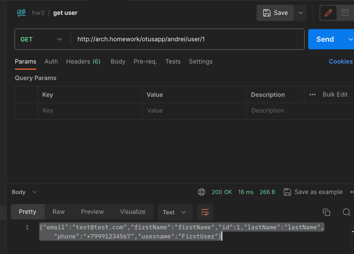
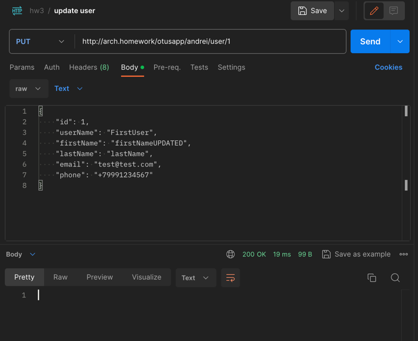
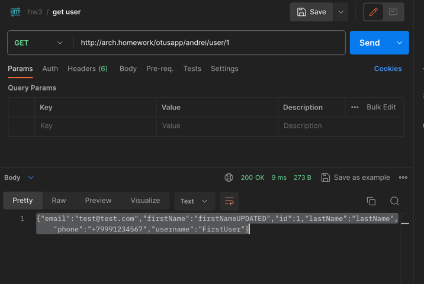
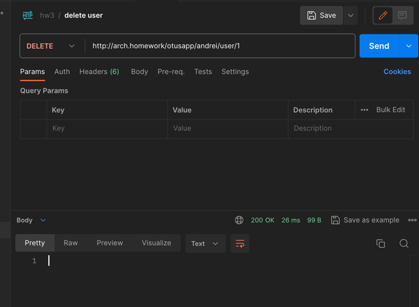

# HW3

simple CRUD application with database

## minikube macOS arm hacks
```
minikube start

minikube addons enable ingress

minikube tunnel
```

## install app 
```
helm install  hw3 ./hw3
```

## test collection results
running hw3.postman_collection.json results









